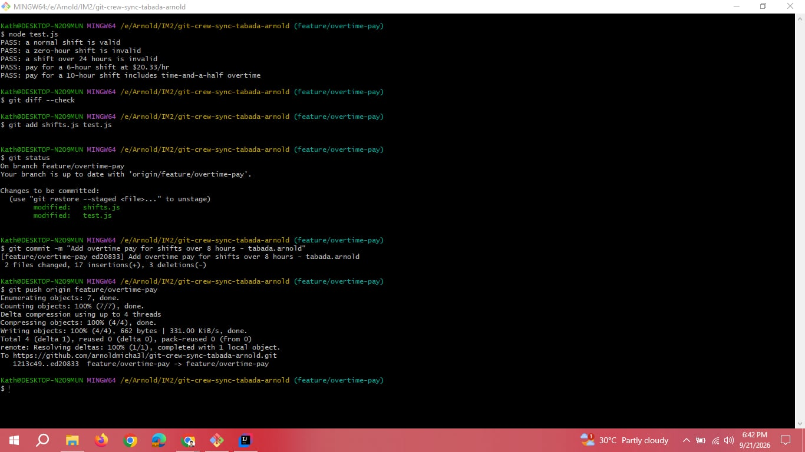
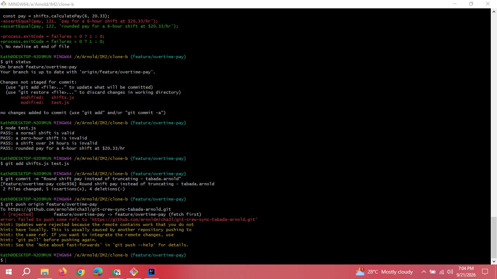
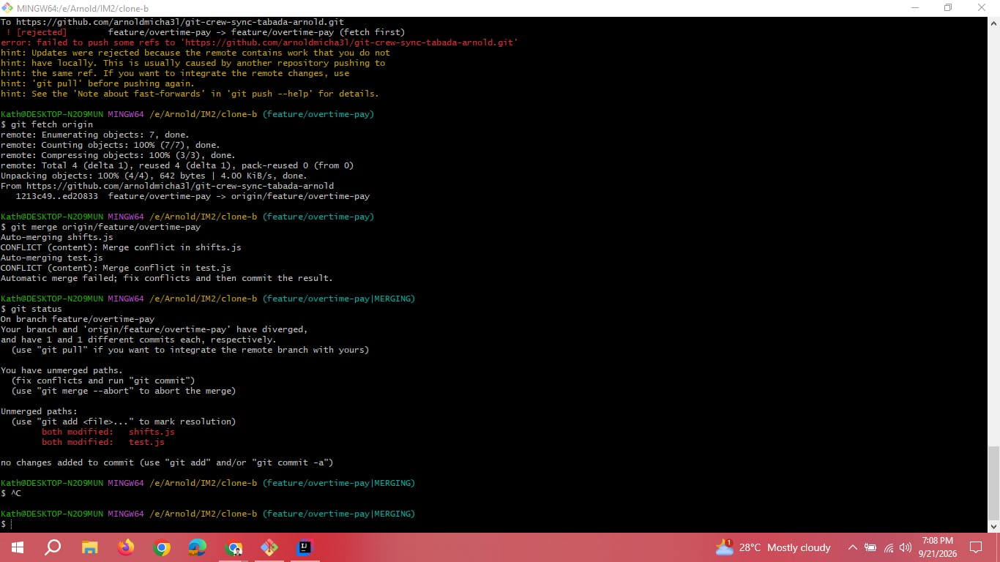
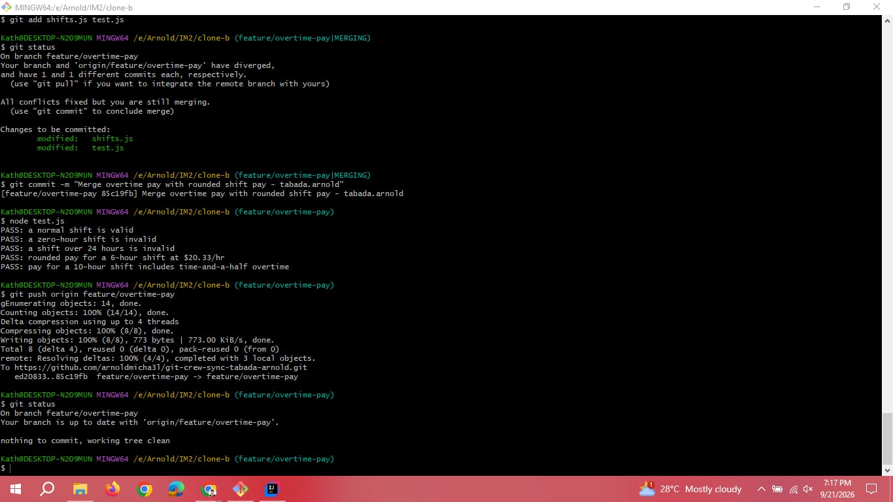
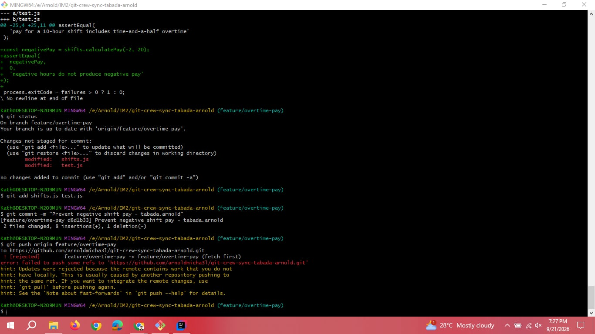
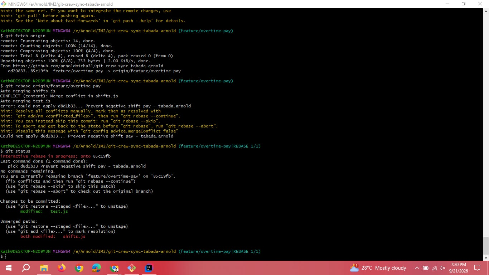
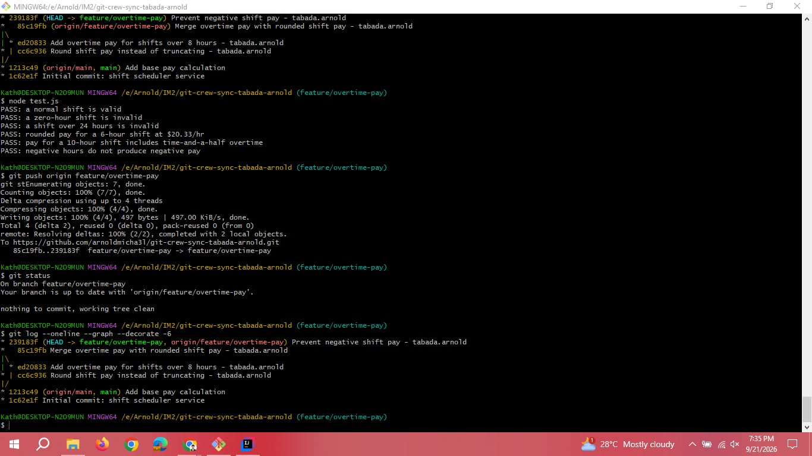
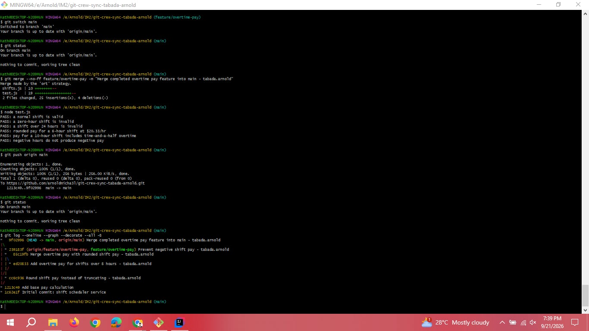
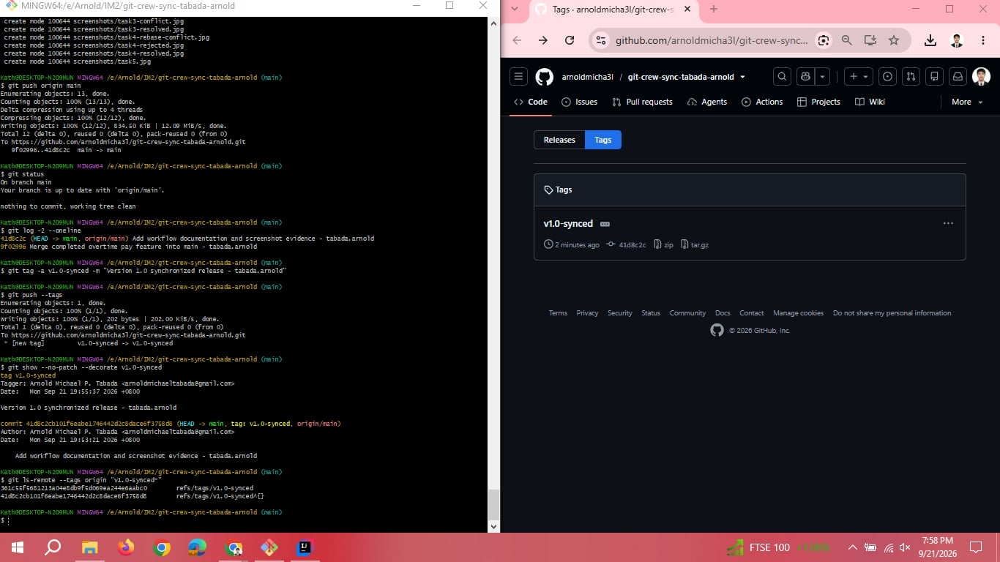

# Crew Sync: Shift Scheduler Git Workflow

**Student:** Arnold Michael P. Tabada

**Repository:** [git-crew-sync-tabada-arnold](https://github.com/arnoldmicha3l/git-crew-sync-tabada-arnold)

This document records the collaborative Git workflow completed using two local clones connected to the same GitHub repository.

## Task 1: Push a Change from Clone A

In Clone A, I checked out `feature/overtime-pay` and updated `calculatePay()` so hours beyond eight are paid at time-and-a-half. I added an overtime test, confirmed that all tests passed, committed the changes, and successfully pushed the feature branch.

**Commit:** `Add overtime pay for shifts over 8 hours - tabada.arnold`

### Task 1 Evidence

## Task 2: Diverge from Clone B and Get Rejected

Without fetching the new commit from Clone A, I changed the same `calculatePay()` function in Clone B. I replaced truncation with `Math.round()`, updated the test expectation, committed the change, and attempted to push it.

The push was rejected because the remote feature branch already contained the overtime commit from Clone A. This produced the required non-fast-forward or fetch-first rejection.

**Commit:** `Round shift pay instead of truncating - tabada.arnold`

### Task 2 Evidence

## Task 3: Reconcile with a Merge

In Clone B, I fetched the remote branch and merged `origin/feature/overtime-pay`. Because both clones changed the same function and related tests, Git produced real merge conflicts in `shifts.js` and `test.js`.

I resolved the conflicts by preserving both behaviors: time-and-a-half overtime after eight hours and rounded final pay. After resolving the files, I completed the merge commit, ran the tests successfully, and pushed the merged branch.

**Merge commit:** `Merge overtime pay with rounded shift pay - tabada.arnold`

### Task 3 Conflict Evidence

### Task 3 Resolution Evidence

## Task 4: Diverge Again and Reconcile with a Rebase

Before fetching the completed merge from Clone B, I made another change in Clone A that prevented negative hours from producing negative pay. I committed the change and attempted to push, but the push was rejected because the remote branch contained commits that Clone A did not yet have.

I fetched the remote history and used `git rebase origin/feature/overtime-pay`. Git produced a real rebase conflict in `shifts.js`. I resolved it by preserving all three behaviors: overtime pay, rounded pay, and a minimum pay of zero. The tests passed, the rebase completed successfully, and I pushed normally without using force.

**Rebased commit:** `Prevent negative shift pay - tabada.arnold`

### Task 4 Rejected Push Evidence

### Task 4 Rebase Conflict Evidence

### Task 4 Resolution Evidence

## Task 5: Merge into Main

In Clone A, I switched to `main` and merged the completed `feature/overtime-pay` branch using a merge commit. I ran all tests successfully and pushed the updated `main` branch to GitHub.

**Merge commit:** `Merge completed overtime pay feature into main - tabada.arnold`

### Task 5 Evidence

## Task 6: Tag the Final Version

After completing the implementation and workflow documentation, I created the `v1.0-synced` tag and pushed it to GitHub.

### Task 6 Evidence

## Written Answers

### 1. What did the rejected push error message tell you, and why did it happen?

The error said that the update was rejected because the remote branch contained work that was not present in my local branch. Git refused the push because accepting it as-is would not be a fast-forward update and could discard or bypass commits already on the shared remote branch. It happened because one clone pushed new work while the other clone continued working from an older copy of the same branch.

### 2. What is the actual difference between how you resolved Task 3 with a merge and Task 4 with a rebase?

In Task 3, merging combined the two divergent histories by creating a new merge commit with both histories as parents. The original commits and the visible branch structure were preserved.

In Task 4, rebasing temporarily removed my local commit, updated the branch to the remote history, and replayed my local change on top of it. This created a new commit hash and produced a more linear history without adding another merge commit.

### 3. What one habit would have avoided both rejected pushes in this lab?

I could have avoided both rejected pushes by synchronizing the branch before starting new work and again before pushing. A consistent habit of running `git fetch` and integrating the latest remote changes, while also coordinating with teammates, would have shown me that the shared branch had advanced before I created or pushed another commit.

### 4. Which approach, merge or rebase, would you default to on a shared team branch, and why?

I would default to merging on a shared team branch because it preserves the existing shared history and does not rewrite commits that teammates may already have. This makes collaboration safer and makes the actual integration points visible. I would use rebase mainly for my own local, unpublished commits when I want to place them cleanly on top of the latest shared work.